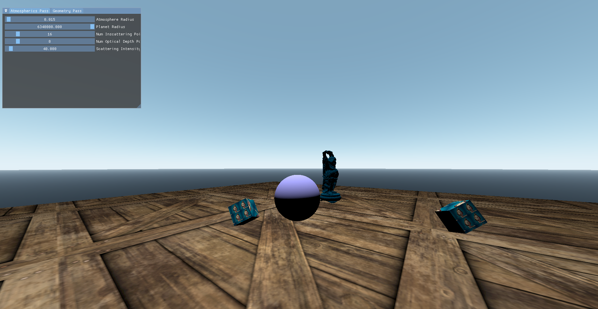

# MyVulkanPlayground
This repository contains the code and assets for my hobby graphics engine where I experiment with implementing modern rendering techniques and systems. It's written in C++ and uses Vulkan for the graphics API and GLSL for shaders.

# Features
In this project I have implemented several systems meant for simplifying interaction with the [Graphics Pipeline](https://en.wikipedia.org/wiki/Graphics_pipeline) and exposed them to a base class called CDrawNode. 

There are helpers for handling keyboard/mouse inputs, resource state tracking, pipeline management & shader binding tables as well as a rudimentary model rendering system. The base class is overridable and has two functions: Init and Draw. Init is called once on startup while Draw runs once per frame. The entire viewport is additionally rendered through ImGui and you can inspect all textures in real time.

You can have a look under [source/VulkanEngine/DrawNodes/](https://github.com/hjelmw/MyVulkanPlayground/tree/main/source/VulkanEngine/DrawNodes
) to see what rendering techniques have currently been implemented.

# Setup
1. Install [VulkanSDK](https://vulkan.lunarg.com/) from Lunarg  (Version 1.4 or above should work)
2. Install [Python](https://www.python.org/downloads/) (Version 3.7 or above should work)
3. `CreateVisualStudioSolution.bat`. It should download all the required dependencies and create the .sln file
4. Open in Visual Studio 2022 (have not tested older versions but it might still work)

## Dependencies
* Vulkan SDK (Your driver needs to support `VK_KHR_DYNAMIC_RENDERING`)
* Python3
* Premake5
* GLFW
* GLM
* ImGUI
* TinyOBJLoader
* stbi_image

