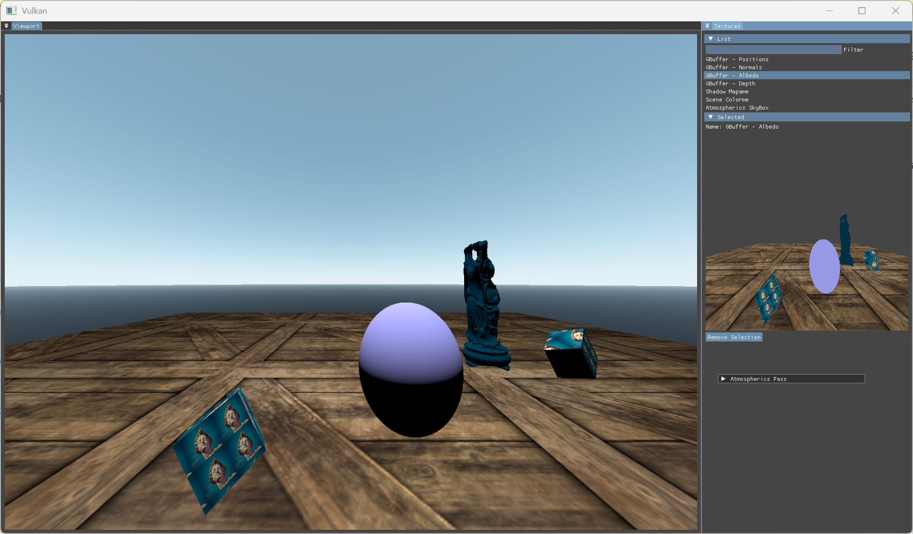

# MyVulkanPlayground
This repository contains the code and assets for my hobby graphics engine where I try out modern rendering techniques. It's written in C++ and uses Vulkan for the graphics API and GLSL for shaders.

# Features
* Model rendering of .obj and materials through .mtl files. 1 texture per model
* Some simple Blinn-Phong shading
* Shadow mapping (but currently bugged 😬)
* Skybox with atmospheric scattering

# Setup
TODO: Make the dependencies into subrepos and add a build script

## Dependencies
* Vulkan SDK
  * Extensions: `VK_KHR_SWAPCHAIN`, `VK_KHR_DYNAMIC_RENDERING`, `VK_EXT_DESCRIPTOR_INDEXING`
* GLFW-3.4
* GLM-0.9.3.4
* ImGUI
* TinyOBJLoader-2.0
* stbi_image

